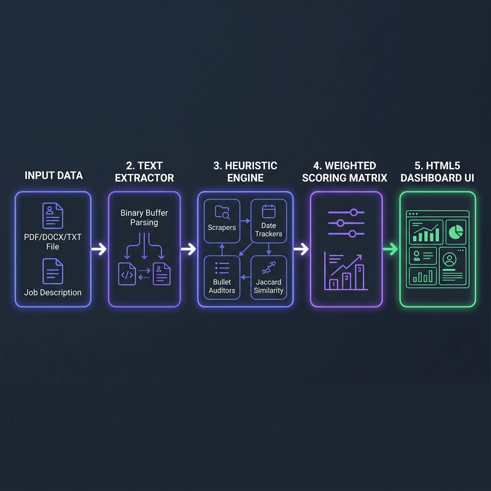

# SmartScreen: Resume Analyzer & Scraper Tool

SmartScreen is a lightweight, local web application designed to help candidates parse resumes, evaluate content layout structures against Applicant Tracking System (ATS) parsing rules, and score technical keyword alignment against job description requirements. The application runs 100% offline using deterministic string tokenizers, Jaccard similarity algorithms, and pattern-matching rules.

---

## ⚙️ Key Features

* **Multi-Format Document Parsing**: Upload resume files (`.pdf`, `.docx`, `.txt`) or paste raw resume text.
* **Granular Structural Checks**: Identifies key modules such as Summary, Experience, Education, Skills, Projects, and Certifications.
* **Header Data Scraper Audit**: Verifies that primary contact details (emails, phone numbers, LinkedIn/GitHub profiles, personal websites) are correctly extractable by machines.
* **Job Posting Skill Alignment**: Paste a target Job Description to run Jaccard-like keyword intersection scoring, showing exactly which technical buzzwords are **Matched** and **Missing**.
* **Bullet Point Phrasing Optimizer**: Flags experience description bullet statements that are weak or lack quantifiable metrics, providing side-by-side phrasing rewrite suggestions.
* **ATS Compatibility Heuristics**: Audits layout issues (graphical bullets, multi-column whitespace markers, word count thresholds) that cause automated parsers to crash or fail.
* **Interactive Fix Checklist**: An interactive task list (saved locally via browser `localStorage`) where users can check off and track their resume editing progress.
* **Report Compiler & Exporters**: Compiles the analysis report into a formatted Markdown document for clipboard copy actions, or downloads the raw JSON metadata payload.
* **Interactive Dashboard**: A premium, responsive dark-themed dashboard featuring animated SVG circular progress gauges and CSS transition loaders.

---

## 🧠 Technologies Used

- **Backend**: Python 3.14+, Flask (for server routing)
- **Text Parsers**: PyPDF2 (PDF buffer extraction), docx2txt (DOCX buffer extraction)
- **Frontend**: HTML5, Vanilla CSS3 (custom CSS variables & gradients), Vanilla JS (ECMAScript 6)
- **Testing**: pytest

---

## 📐 Architecture & Data Flow

Below is the processing pipeline that resumes follow upon submission:



### 1. Document Extraction Phase
* **Buffer Stream Parsing**: The text extractor reads incoming binary file buffers (PDF/DOCX/TXT) and outputs a clean, layout-neutral text stream.
* **Normalization**: The raw text is lowercased and tokenized into alphanumeric words. Stopwords are filtered out to isolate core technical skills and metrics.

### 2. Heuristic Analysis Phase
* **Header Data Scraper**: Compiled regex patterns locate contact fields (email, phone, LinkedIn/GitHub urls, personal portfolios).
* **Experience Duration Tracker**: Estimates cumulative career span by parsing date ranges (e.g. `2018 - Present`).
* **Bullet Statement Auditor**: Evaluates bullet items to verify they start with strong action verbs and contain numeric accomplishments.
* **ATS Compatibility Auditor**: Scans for layout irregularities (visual delimiters, excessive column gaps) that break tracking parsers.
* **Jaccard Overlap Alignment**: Tokenizes the target job listing description to calculate technical skill matches and identify missing buzzwords.

### 3. Scoring & Dashboard Output Phase
* **Weighted Evaluation**: Feeds results into a mathematical weights matrix to compute the overall percentage rating.
* **JSON Payload Handshake**: Packs results into a local JSON object template.
* **UI Render**: Binds score values to SVG progress circles, renders the skill badge grids, and initializes the interactive checklists (persisting states in `localStorage`).

---

## 🔢 Scoring System Algorithm & Formula

The overall score is computed out of **100%** based on a weighted combination of 7 key dimensions:

| Category | Weight | Target Criteria |
| :--- | :---: | :--- |
| **Keywords & Skills** | 20% | Up to 15 industry-relevant technical keywords matched in text. |
| **Required Sections** | 20% | Detection of core headers (Summary, Experience, Education, Skills, Projects, Certifications). |
| **Action Verbs** | 15% | Uses 12+ dynamic verbs (e.g., *Spearheaded*, *Optimized*, *Architected*). |
| **Formatting & Structure** | 15% | Ratio of bullet points starting with action verbs (60% target) combined with a count benchmark (8+ bullets). |
| **Quantifiable Metrics** | 15% | Density of numeric metrics (percentages, scales, budgets, user sizes) across bullet points (6+ metrics target). |
| **Target Alignment** | 10% | Keyword overlap coefficient with target Job Title or Jaccard similarity score against Job Description text. |
| **Contact Channels** | 5% | Extraction of both Email and Phone numbers from header strings. |

> [!NOTE]
> **ATS Penalty Adjustment**:
> A final **ATS Compatibility Score** (0-100%) is calculated independently by subtracting points for layout pitfalls (e.g. -20 for missing email/phone, -15 for excessive length, -10 for complex multi-column spaces, -10 for graphic character bullet dividers). 
> 
> The final score displayed on the dashboard is calculated as:
> $$\text{Final Score} = (\text{Heuristic Score} \times 0.9) + (\text{ATS Readability Rating} \times 0.1)$$

---

## 🔍 Core Regex Parsing Logic

The analyzer utilizes highly specific compiled regular expressions to scrape candidate data:

### 1. Header Scrapers
* **Emails**: `[\w\.-]+@[\w\.-]+\.[a-zA-Z]{2,}`
* **Phone Numbers**: `(?:\+?\d{1,3}[\s-]?)?(?:\(\d{3}\)|\d{3})[\s-]?\d{3}[\s-]?\d{4}`
* **Social Profiles (LinkedIn/GitHub)**: `linkedin\.com/[\w\-]+` and `github\.com/[\w\-]+`
* **Personal Portfolios**: `https?://[\w\.-]+\.[a-zA-Z]{2,}(/[\w\-./?%&=]*)?`

### 2. Experience Date-Range Tracker
Estimates career span by searching for chronological boundaries:
```regex
\b(19\d{2}|20\d{2})\b\s*(?:-|–|to)\s*\b(19\d{2}|20\d{2}|present|current)\b
```
It sums the differences between extracted start and end dates (substituting `"present"/"current"` with the active system calendar year) to compute cumulative experience.

### 3. Metric Quantity Scanners
Checks accomplishments using standard metric regex:
* **Percentage rates**: `\d+%`
* **Financial valuations**: `\$\d+[\d,]*`
* **Project scale factors**: `\d{2,}\s*(?:people|users|clients|servers|databases|projects|leads|bugs)`

---

## 🛠️ Development & Customization Guide

### 1. Extending the Keyword Database
To add new technologies or programming languages to the parser, edit the dictionary `CATEGORIZED_KEYWORDS` inside `utils/resume_analyzer.py`:
```python
CATEGORIZED_KEYWORDS = {
    "Languages": [
        "Python", "JavaScript", "TypeScript", ...
        "YourNewLanguage" # Add here
    ],
    ...
}
```

### 2. Adding Custom Phrasing Optimization Templates
To add custom "Before & After" bullet recommendations, append templates to the `REWRITE_TEMPLATES` list in `utils/resume_analyzer.py`:
```python
REWRITE_TEMPLATES = [
    ...
    {
        "pattern": r"\b(your_keyword_regex)\b",
        "before_default": "Standard weak sentence placeholder",
        "after": "Optimized rewrite phrasing with [metric] placeholders."
    }
]
```

---

## 🚀 Setup & Launch

1. **Activate your environment** and install requirements:
   ```bash
   pip install -r requirements.txt
   ```
2. **Start the local server**:
   ```bash
   python app.py
   ```
3. **Open the browser**:
   Navigate to `http://127.0.0.1:5000`

---

## 🧪 Testing

Install test suites and execute tests:
```bash
pip install -r requirements-dev.txt
pytest
```


